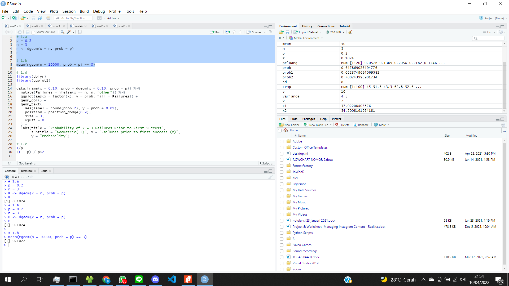
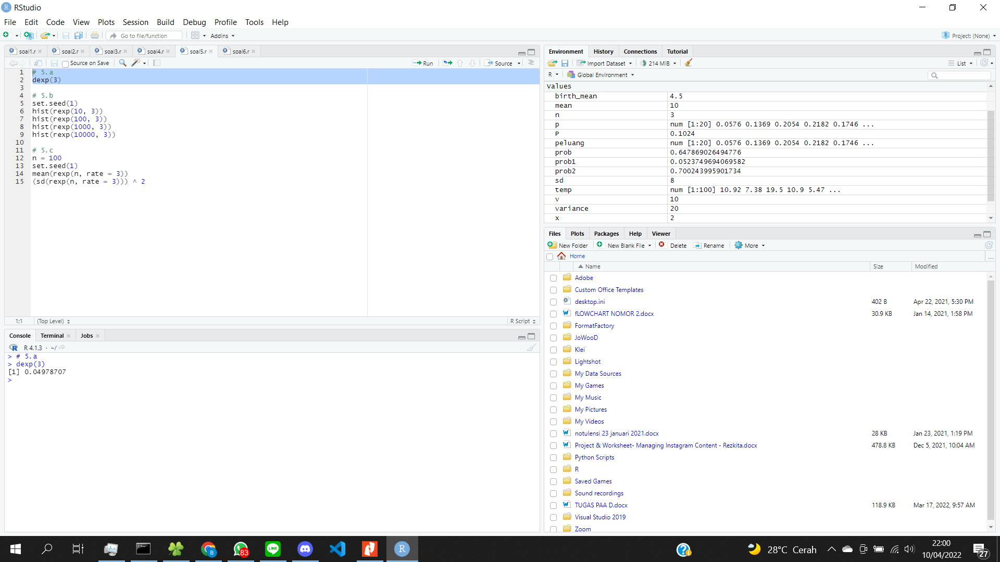

# P1_Probstat_E_5025201227

Bimantara Tito Wahyudi  <-->  5025201227

## Soal 1

### 1.a

#### Source Code
```R
p = 0.2
n = 3
P <- dgeom(x = n, prob = p)
P
```

#### Hasil


### 1.b

#### Source Code
```R
mean(rgeom(n = 10000, prob = p) == 3)
```

#### Hasil


### 1.c

#### Penjelasan

Poin A dan poin B memberikan hasil yang berbeda. Poin A melakukan distribusi geometrik biasa dan akan selalu memberikan nilai tetap. Sedangkan poin B, digunakan fungsi random untuk melakukan distribusi geometrik sehigga poin B memberikan hasil yang tidak tetap. Dalam hal ini, poin B lebih baik untuk dijadikan sample

### 1.d

#### Source Code
```R
library(dplyr)
library(ggplot2)

data.frame(x = 0:10, prob = dgeom(x = 0:10, prob = p)) %>%
  mutate(Failures = ifelse(x == n, n, "other")) %>%
  ggplot(aes(x = factor(x), y = prob, fill = Failures)) +
  geom_col() +
  geom_text(
    aes(label = round(prob,2), y = prob + 0.01),
    position = position_dodge(0.9),
    size = 3,
    vjust = 0
  ) +
  labs(title = "Probability of X = 3 Failures Prior to First Success",
       subtitle = "Geometric(.2)", x = "Failures prior to first success (x)",
       y = "Probability") 
```

#### Hasil


### 1.e

#### Source Code
```R
mean(rgeom(n = 10000, prob = p) == 3)
```

#### Hasil


## Soal 2

### 2.a

#### Source Code
```R
dbinom(4, size = 20, prob = 0.2)
```

#### Hasil


### 2.b

#### Source Code
```R
p <- dbinom(1:20, 20, 0.2)
data = data.frame(y=c(p), x=c(1:20))
barplot(data$y, names.arg=data$x, ylab="Probability", xlab="Number of Patients")
```

#### Hasil


### 2.c

#### Source Code
```R
4*0.2
4*0.2*(1-0.2)
```

#### Hasil


## Soal 3

```R
birth_mean = 4.5
```

### 3.a

#### Source Code
```R
dpois(6, birth_mean)
```

#### Hasil


### 3.b

#### Source Code
```R
set.seed(2)
babies <- data.frame('data' = rpois(365, 4.5))
babies %>% ggplot() +
    geom_histogram(aes(x = data,y = stat(count / sum(count)), fill = data == 6),
    binwidth = 1, color = 'black',) + scale_x_continuous(breaks = 0:10) + 
    labs(x = 'Number of babies born per period', y = 'Proportion',
    title = '365 simulated births in a hospital with Pois(lambda = 4.5)') + theme_bw()
```

#### Hasil


### 3.c

#### Penjelasan

Poin A dan B memberikan hasil yang hampir sama, yakni poin A 12,8% dan poin B kurang lebih 11%. Hal ini disebabkan karena hasil dari poin A terdapat di dalam range dari poin B. Oleh sebab itu, estimasi jumlah bayi yang akan dilahirkan selama setahun akan memberikan hasil yang mirip dengan estimasi di esok hari

### 3.d

#### Source Code
```R
variance = birth_mean
birth_mean
variance
```

#### Hasil


## Soal 4

```R
x = 2
v = 10
```

### 4.a

#### Source Code
```R
dchisq(x, v)
```

#### Hasil


### 4.b

#### Source Code
```R
temp = rchisq(100, v)
hist(temp)
```

#### Hasil


### 4.c

#### Source Code
```R
mean = v
mean
variance = 2*v
variance
```

#### Hasil


## Soal 5

### 5.a

#### Source Code
```R
dexp(3)
```

#### Hasil


### 5.b

#### Source Code
```R
set.seed(1)
hist(rexp(10, 3))
hist(rexp(100, 3))
hist(rexp(1000, 3))
hist(rexp(10000, 3))
```

#### Hasil


### 5.c

#### Source Code
```R
n = 100
set.seed(1)
mean(rexp(n, rate = 3))
(sd(rexp(n, rate = 3))) ^ 2
```

#### Hasil


## Soal 6

```R
n = 100
mean = 50
sd = 8
```

### 6.a

#### Source Code
```R
set.seed(1)
temp <- rnorm(n, mean, sd)
temp
summary(temp)

x1 = runif(1, min = min(temp), max = mean)
x2 = runif(1, min = mean, max = max(temp))
x1
x2

prob1 <- pnorm(x1, mean, sd)
prob2 <- pnorm(x2, mean, sd)
prob1
prob2

prob <- prob2 - prob1
plot(temp)
```

#### Hasil


### 6.b

#### Source Code
```R
data = temp
hist(data, breaks = 50, main = "5025201237_Bimantara Tito Wahyudi_E_DNHistogram")
```

#### Hasil


### 6.c

#### Source Code
```R
(sd(data)) ^ 2
```

#### Hasil

